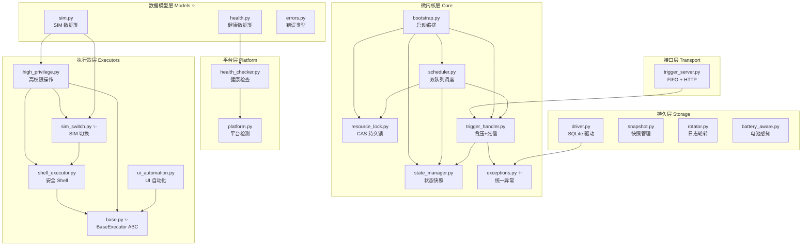

## 用户需求

根据当前代码库的架构现状，对 atlas-runtime 项目进行全面架构优化设计，提升代码的模块化、可维护性、可扩展性和性能。

## 产品概览

atlas-runtime 是一个运行在 Samsung One UI 8.5 + Termux 环境下的 Android 自动化运行时，采用 asyncio 异步架构，通过微内核调度器编排 Shell 执行器、UI 自动化、高权限操作等组件，并通过双模触发器 (FIFO + HTTP) 接收外部指令。

## 核心优化目标

### P0 级（阻塞性问题）
- **消除重复文件**：`core/shell_executor.py`（兼容性存根）和 `executors/shell_executor.py`（真正实现）功能重叠但缺少 `_build_env()` 方法导致 Termux PATH 适配缺失
- **目录职责分离**：`core/` 既包含微内核组件又包含平台检测和健康检查，混合了不同抽象层次
- **拆分臃肿模块**：`executors/high_privilege.py` (30.81KB, 799行) 混合了 SIM 数据类、ABC 接口、ShizukuSimManager、WiFi/Data/Airplane/Volume 控制逻辑

### P1 级（架构债务）
- **建立数据模型层**：BatteryStatus、MemoryStatus、SystemHealth、SimInfo、SimStatus、SimSwitchResult 散落各处，缺乏集中化的数据契约
- **创建执行器基类**：SafeShellExecutor、UIAutomationExecutor、HighPrivilegeExecutor 无共享抽象基类，返回格式不统一
- **解耦跨层依赖**：`trigger_handler.py` 直接导入 `storage.driver.StorageFullError`（core 层依赖 storage 层），`health_checker.py` 直接导入 `core.platform`

### P2 级（完善性）
- **补全核心导出**：`core/__init__.py` 未导出 platform、health_checker，但外部直接使用 `from core.platform` 和 `from core.health_checker`
- **更新架构文档**：输出完整的 ARCHITECTURE.md 记录优化后的架构设计

## 技术栈

- **语言**：Python 3.10+
- **异步框架**：asyncio（原生协程）
- **数据存储**：SQLite (WAL 模式) + 自定义单写者队列驱动
- **序列化**：msgpack
- **目标平台**：Samsung One UI 8.5 + Termux
- **测试**：pytest (35+ 现有测试用例)

## 实现方案

### 总体策略

采用**渐进式重构**策略，通过兼容性存根保证所有现有导入路径不受影响。核心原则：

1. **新增优于删除**：先建立新的 `models/` 和 `platform/` 包，再逐步迁移，旧位置保留兼容性存根
2. **批量操作减少回归**：将相关性强的文件修改合并到同一任务中
3. **测试先行验证**：每完成一批迁移立即运行测试确保不引入回归
4. **向后兼容承诺**：所有公共 API 导入路径保持不变

### 优化后的五层架构

**层间依赖规则（自上而下，禁止反向）**：
- Transport → Core（触发器调用内核）
- Core → Storage（内核持久化状态）
- Platform → Core（平台检测被内核使用）
- Executors → Core（执行器被调度器调用）
- Models → 无依赖（纯数据契约）
- 所有层 → Models（共享数据契约）

### 关键设计决策

**1. 为何新增 `models/` 而非放入 `core/`**
- `core/` 定位为微内核，包含有生命周期的活动组件（start/stop）
- 数据类是无状态的纯数据契约，逻辑上属于跨层共享基础设施
- 独立包避免循环导入问题，所有层都可以安全引用 models

**2. 为何新增 `platform/` 而非保留在 `core/`**
- `platform.py` 和 `health_checker.py` 属于平台适配层，与内核调度/状态管理职责不同
- 分离后 core/ 仅保留 5 个微内核组件，职责单一清晰
- 未来可扩展更多平台相关能力（如不同厂商适配）

**3. 为何拆分 SIM 逻辑到独立文件而非保留在 `high_privilege.py`**
- SimInfo/SimStatus/SimSwitchResult 数据类 → `models/sim.py`
- AutoJS6SimSwitcher ABC → `executors/sim_switch.py`
- ShizukuSimManager → `executors/sim_switch.py`
- HighPrivilegeExecutor 仅保留 WiFi/Data/Airplane/Volume + SIM 委托调用
- 降低单文件复杂度（799行 → ~400行 + ~400行），提升可读性和可测试性

**4. 为何需要 BaseExecutor ABC**
- 统一执行器接口契约：`execute(command) → ExecutorResult`
- 标准化错误处理和日志记录
- 便于未来扩展新的执行器类型（如 ADB Executor）
- 提供默认的超时和重试逻辑

**5. 跨层依赖解耦方案**
- `StorageFullError` 从 `storage/driver.py` 提升到 `models/errors.py`，storage 和 core 均从 models 导入
- `PlatformInfo` 保持 `from core.platform` 可用（兼容性存根），新代码推荐 `from platform`

### 性能与可维护性

- **无性能影响**：重构仅涉及模块组织和导入路径变更，不影响运行时执行路径
- **降低认知负荷**：单文件行数从 799 行降至 ~400 行，模块职责单一
- **提升可测试性**：SIM 切换逻辑独立后可单独 mock 测试，不依赖 WiFi/Data 控制
- **导入即兼容**：所有旧导入路径通过兼容性存根保持有效，零破坏性变更

### 实现注意事项

- **不修改运行时逻辑**：仅重组文件结构，不改变任何业务逻辑、算法或配置
- **保持 Logger 名称不变**：模块移动后 Logger 名称保持原样（如 `Atlas.HealthChecker`），避免日志分析工具失效
- **测试覆盖**：35 个现有测试用例全部通过是硬性门禁
- **兼容性存根生命周期**：在 `core/platform.py`、`core/health_checker.py`、`core/shell_executor.py` 放置 `from xxx import *` 存根，标记 deprecated 警告，未来大版本移除
- **分批提交**：每完成一个 Phase 进行一次 git commit，便于回滚和 review

