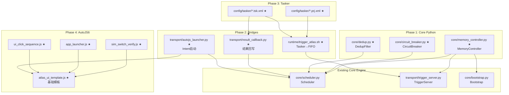

## 用户需求

根据项目设计文档全面审查当前代码生成进度，确认已完成模块与待开发内容的差异；列出所有需要生成的 Tasker 配置文件和 AutoJS6 脚本文件的完整清单，按功能模块分类，标注优先级（高/中/低）和依赖关系；制定分阶段生成计划，明确目标、时间节点、交付物列表及验收标准；确保存在依赖关系的文件生成顺序合理；输出结构化的后续开发计划表格。

## 产品概述

Atlas Runtime v9.1 核心 Python 引擎（37 个源文件、~5,275 行代码、236 项测试通过）已完成 95%，现需补齐外部集成层（Tasker 配置文件、AutoJS6 脚本）、集成桥接模块（Python）、设计超前模块（MemoryController/CircuitBreaker/Dedup）及配套文档，使系统从"引擎就绪"达到"端到端可用"。

## 核心功能

1. **MemoryController 内存守护**：三级探测策略（psutil → /proc/self/status → 兜底估算），软限暂停接单、硬限强制 GC + 拒绝写入，防抖机制避免状态抖动
2. **CircuitBreaker 熔断器**：CLOSED → OPEN → HALF_OPEN 三态模型，连续失败 5 次熔断，30 秒冷却后半开探测
3. **Dedup 去重**：基于 correlation_id + TTL（60 秒）的内存去重窗口，防重复触发
4. **Tasker 集成全套配置**：4 个 Profile XML（时间/事件/状态/通用）、4 个 Task XML（SIM 切换/WiFi 切换/通用触发/结果处理）、1 个 shell 桥接脚本 trigger_atlas.sh、1 个 Python 结果回写模块 result_callback.py
5. **AutoJS6 集成全套脚本**：1 个通用 UI 模板 atlas_ui_template.js（基础框架，所有其他脚本的基类）、5 个专用脚本（SIM 验证/APP 启动/UI 点击序列/健康检查/电池监控）、1 个 Python 启动器 autojs_launcher.py
6. **端到端 E2E 测试清单**：覆盖 SIM 切换、UI 自动化、崩溃恢复、快照冷恢复四个关键场景
7. **用户指南文档**：Tasker 集成配置指南 + AutoJS6 脚本开发指南


## 技术栈

| 层次 | 技术 | 说明 |
|:---|:---|:---|
| 核心 Python 模块 | Python 3.11+、asyncio、psutil（可选） | MemoryController/CircuitBreaker/Dedup |
| 桥接脚本 | Bash（Termux）、Python asyncio | trigger_atlas.sh、result_callback.py、autojs_launcher.py |
| Tasker 配置 | XML（Tasker .prj.xml / .tsk.xml） | 遵循 Tasker XML 导出格式规范 |
| AutoJS6 脚本 | JavaScript（Rhino 引擎）、ES5+/部分 ES6 | 基于 auto.waitFor() 无障碍服务 |
| 文档 | Markdown | Tasker 集成指南、AutoJS6 开发指南 |

## 实现方案

### 总体策略

采用 **五阶段顺序生成**，严格遵循依赖关系：核心 Python 模块（无外部依赖）→ 集成桥接脚本（依赖核心引擎已完成接口）→ Tasker XML 配置（依赖桥接脚本路径和接口确定）→ AutoJS6 JS 脚本（依赖 UI 模板基类先完成）→ E2E 测试 + 文档（依赖全部实现稳定）。

### 关键设计决策

1. **MemoryController 采用被动门控模型**：不启动后台循环，仅在关键决策点（Scheduler.submit、TriggerServer 接收）同步探测，零 CPU 持续开销，符合移动设备省电原则
2. **三级探测策略降级链**：psutil.Process().memory_info().rss → /proc/self/status VmRSS → platform.total_ram_mb/2 估算，psutil 不可用时优雅降级而非整体失败
3. **Tasker 与 AutoJS6 通过共享目录解耦**：/sdcard/atlas_shared/ 作为数据交换区，Tasker 读取 last_result.json 获取执行结果，AutoJS6 写入 autojs_fallback_*.json 作为 HTTP 回调失败时的兜底
4. **AutoJS6 UI 模板采用参数化设计**：通过 engines.myEngine().execArgv.scriptParams 接收 JSON 参数，所有专用脚本均基于同一模板扩展，减少重复代码
5. **HTTP 回调 + 本地文件双通道**：AutoJS6 优先通过 HTTP POST /trigger 回调 Atlas，失败时自动降级为本地文件写入，Atlas 侧通过文件轮询检测兜底结果

### 依赖关系排序

```
Phase 1: 核心 Python 模块（独立，可并行）
  ├── core/memory_controller.py       → 无依赖
  ├── core/circuit_breaker.py         → 无依赖
  └── core/dedup.py                   → 无依赖

Phase 2: 集成桥接脚本（依赖 Phase 1 + 已有核心引擎）
  ├── runtime/trigger_atlas.sh        → 依赖 config/runtime.yaml 的 fifo_path
  ├── transport/result_callback.py    → 依赖 Scheduler.on_task_complete 回调钩子（已实现）
  └── transport/autojs_launcher.py    → 依赖 SafeShellExecutor.run_command（已实现）

Phase 3: Tasker XML 配置（依赖 Phase 2 桥接脚本）
  ├── config/tasker/atlas_trigger.prj.xml  → 聚合所有 Profile + Task
  ├── config/tasker/profile_time.xml       → 依赖 trigger_atlas.sh
  ├── config/tasker/profile_event.xml      → 依赖 trigger_atlas.sh
  ├── config/tasker/profile_state.xml      → 依赖 trigger_atlas.sh
  ├── config/tasker/task_sim_switch.tsk.xml → 依赖 trigger_atlas.sh + result_callback.py
  ├── config/tasker/task_wifi_toggle.tsk.xml → 依赖 trigger_atlas.sh
  ├── config/tasker/task_generic_trigger.tsk.xml → 依赖 trigger_atlas.sh
  └── config/tasker/task_result_handler.tsk.xml → 依赖 result_callback.py 输出格式

Phase 4: AutoJS6 JS 脚本（依赖 Phase 2 autojs_launcher.py + 模板基类）
  ├── scripts/autojs/atlas_ui_template.js     → 基础模板，所有其他脚本的核心框架
  ├── scripts/autojs/sim_switch_verify.js     → 依赖 atlas_ui_template.js
  ├── scripts/autojs/app_launcher.js           → 依赖 atlas_ui_template.js
  ├── scripts/autojs/ui_click_sequence.js      → 依赖 atlas_ui_template.js
  ├── scripts/autojs/health_check_ui.js        → 依赖 atlas_ui_template.js
  └── scripts/autojs/battery_monitor.js        → 依赖 atlas_ui_template.js

Phase 5: 文档 + E2E（依赖 Phase 1-4 全部内容稳定）
  ├── tests/e2e/test_checklist.md
  ├── docs/TASKER_INTEGRATION_GUIDE.md
  └── docs/AUTOJS6_SCRIPT_GUIDE.md
```

### 性能与可靠性考量

- **MemoryController 探测开销**：同步调用 `can_accept()` 时通过 `asyncio.to_thread()` 执行探测，避免阻塞事件循环；防抖（连续 3 次相同才切换）避免因瞬时 GC 导致状态抖动
- **CircuitBreaker 无锁设计**：使用 Python 的原子赋值操作替代锁，状态切换无竞态条件
- **Dedup 内存优化**：使用 OrderedDict + 惰性过期清理（最多 10000 条目），避免全量扫描；key 为 `hash(action + correlation_id)` 的 64 位整数，碰撞概率可忽略
- **trigger_atlas.sh FIFO 写入**：使用 `[ -p "$FIFO_PATH" ]` 检测 FIFO 存在性，不存在时自动回退到 HTTP 备通道（curl POST），保证 Tasker 触发链路不中断
- **result_callback.py 原子写入**：临时文件 + `os.replace()` 原子重命名，防止 Tasker 读到半写入的 JSON

## 实现注意事项

### 安全性
- autojs_launcher.py 通过 `am startservice` 启动 AutoJS6 时，参数通过文件传递（写入 `/sdcard/atlas_shared/autojs_params_{uuid}.json`，Intent 仅传递文件路径），避免 Intent extras 大小限制（1MB）和 Shell 注入风险
- result_callback.py 写入前检查磁盘空间（< 10MB 时记录 WARNING 但不阻塞），写完后校验 JSON 合法性

### 三星 One UI 8.5 兼容性
- autojs_launcher.py 的 Intent 启动路径需同时尝试 `org.autojs.autoxjs.v6` 和 `org.autojs.autojs` 两个包名
- Samsung Knox 可能拦截 `am startservice`，提供备选方案：写入启动标记文件 → AutoJS6 侧定时脚本检测文件 → 自启动

### 日志规范
- 所有新增 Python 模块使用 `logging.getLogger(f"Atlas.{ModuleName}")` 格式，与现有模块保持一致
- AutoJS6 脚本使用 `console.log()` 和 `toast()`，失败时将日志追加到 `/sdcard/atlas_shared/autojs.log`

## 架构设计

### 系统架构图（新增组件用 ★ 标记）



### 目录结构（仅展示新增和修改文件）

```
atlas-runtime/
├── core/
│   ├── memory_controller.py          # [NEW] 内存守护模块。三级探测策略（psutil→/proc→兜底），
│   │                                  #   软限/硬限两级门控，防抖机制，优雅降级。
│   ├── circuit_breaker.py            # [NEW] 熔断器模块。CLOSED→OPEN→HALF_OPEN 三态模型，
│   │                                  #   连续失败 N 次熔断，冷却后半开探测。
│   ├── dedup.py                      # [NEW] 去重过滤器。OrderedDict + TTL 窗口，
│   │                                  #   惰性过期清理，correlation_id 去重。
│   ├── bootstrap.py                  # [MODIFY] 新增 MemoryController 实例化与注册。
│   └── scheduler.py                  # [MODIFY] 新增 MemoryController 门控检查 +
│   │                                  #   CircuitBreaker 失败计数 + Dedup 去重。
├── transport/
│   ├── result_callback.py            # [NEW] 结果回写模块。Scheduler.on_task_complete 回调，
│   │                                  #   将任务结果写入 /sdcard/atlas_shared/ 供 Tasker 读取。
│   ├── autojs_launcher.py            # [NEW] AutoJS6 启动器。通过 am startservice 启动脚本，
│   │                                  #   参数经文件传递，支持包名双方案回退。
│   └── trigger_server.py            # [MODIFY] HTTP 通道新增 MemoryController 503 响应。
├── runtime/
│   ├── trigger_atlas.sh              # [NEW] Tasker→FIFO 桥接脚本。Termux:Tasker 插件调用入口，
│   │                                  #   FIFO 不可用时自动 HTTP 回退。
│   └── app.py                        # [MODIFY] 注册 MemoryController 状态变更回调到 HealthChecker。
├── config/
│   ├── runtime.yaml                  # [MODIFY] 激活 memory/circuit_breaker/dedup 配置段（去除注释标记）。
│   └── tasker/                       # [NEW] Tasker 配置目录
│       ├── atlas_trigger.prj.xml     #   完整项目文件，聚合全部 Profile + Task，可直接导入 Tasker
│       ├── profile_time.xml          #   时间触发 Profile（如 08:55 切换 SIM）
│       ├── profile_event.xml         #   事件触发 Profile（收到特定通知）
│       ├── profile_state.xml         #   状态触发 Profile（电量 < 20%）
│       ├── task_sim_switch.tsk.xml   #   SIM 切换完整 Task（7 步 Action）
│       ├── task_wifi_toggle.tsk.xml  #   WiFi 切换 Task
│       ├── task_generic_trigger.tsk.xml # 通用 JSON 触发 Task（可复用模板）
│       └── task_result_handler.tsk.xml  # 结果处理 Task（读取 + 通知）
├── scripts/
│   └── autojs/                       # [NEW] AutoJS6 脚本目录
│       ├── atlas_ui_template.js      #   通用 UI 自动化模板（~250 行），核心框架 + 结果上报
│       ├── sim_switch_verify.js      #   SIM 切换后验证脚本（检测运营商名称变化）
│       ├── app_launcher.js           #   通用 APP 启动 + 操作脚本
│       ├── ui_click_sequence.js      #   通用 UI 点击序列脚本
│       ├── health_check_ui.js        #   系统健康检查 UI 验证脚本
│       └── battery_monitor.js        #   电池状态监控 UI 脚本
├── tests/
│   ├── test_memory_controller.py     # [NEW] MemoryController 单元测试（8 个用例）
│   ├── test_circuit_breaker.py       # [NEW] CircuitBreaker 单元测试（6 个用例）
│   ├── test_dedup.py                 # [NEW] DedupFilter 单元测试（5 个用例）
│   └── e2e/
│       └── test_checklist.md         # [NEW] E2E 测试逐项检查清单
└── docs/
    ├── TASKER_INTEGRATION_GUIDE.md   # [NEW] Tasker 集成配置指南
    └── AUTOJS6_SCRIPT_GUIDE.md       # [NEW] AutoJS6 脚本开发指南
```

## 关键代码结构

### MemoryController 核心接口

```python
# core/memory_controller.py
from dataclasses import dataclass, field
from enum import Enum, auto
from typing import Callable, Optional

class GateState(Enum):
    ACCEPT = auto()         # 正常
    SOFT_THROTTLE = auto()  # 软限
    HARD_REJECT = auto()    # 硬限

@dataclass
class MemoryGate:
    state: GateState
    rss_mb: int
    soft_limit_mb: int
    hard_limit_mb: int
    reason: str

@dataclass
class MemoryStats:
    current_rss_mb: int
    peak_rss_mb: int
    state_history: list          # 最近 10 次状态变化
    rejection_count: int

class MemoryController:
    def __init__(self, soft_limit_mb: int, hard_limit_mb: int, check_stability: int = 3) -> None
    async def can_accept(self) -> MemoryGate      # 门控检查，通过 asyncio.to_thread 执行探测
    async def current_rss_mb(self) -> int         # 当前 RSS（MB）
    async def stats(self) -> MemoryStats           # 统计快照
    def on_state_change(self, callback: Callable) -> None  # 状态变更回调
```

### CircuitBreaker 核心接口

```python
# core/circuit_breaker.py
class CircuitState(Enum):
    CLOSED = "closed"
    OPEN = "open"
    HALF_OPEN = "half_open"

class CircuitBreaker:
    def __init__(self, failure_threshold: int = 5, recovery_timeout: float = 30.0) -> None
    def record_success(self) -> None
    def record_failure(self) -> None
    def is_open(self) -> bool       # 熔断器是否开启（拒绝执行）
    def get_state(self) -> str      # 当前状态字符串
```

### DedupFilter 核心接口

```python
# core/dedup.py
class DedupFilter:
    def __init__(self, ttl: float = 60.0, max_entries: int = 10000) -> None
    def is_duplicate(self, correlation_id: str) -> bool   # O(1) 去重判断
    def mark_seen(self, correlation_id: str) -> None
    async def cleanup_expired(self) -> int                # 惰性过期清理，返回清理条数
```


## Agent Extensions

以下技能将在各阶段文件生成中被使用，确保生成的 Tasker XML 和 AutoJS6 JS 文件格式规范、兼容目标平台：

### Skill

- **tasker**
  - 用途：生成 Tasker Profile/Task/Project XML 文件时，校验 XML 结构符合 Tasker 导入格式规范，确保 Action 类型、参数、条件表达式正确
  - 预期结果：8 个 XML 文件均可被 Tasker v5.15+ 直接导入，无需手动修正

- **autojs6**
  - 用途：生成 AutoJS6 JavaScript 脚本时，校验 API 兼容性（Rhino 引擎、ES5/ES6 限制）、无障碍服务规范、控件选择器语法
  - 预期结果：6 个 JS 脚本均可在 AutoJS6 v6.5+ 上无障碍执行，无运行时错误

- **atlas-synergy-agent**
  - 用途：协调 Tasker/AutoJS6/Python 四者集成链路，验证 File 1.1 中定义的 FIFO/HTTP/共享目录通道在各阶段文件中的一致性
  - 预期结果：跨组件数据通道（FIFO 路径、HTTP 端口、共享目录、correlation_id）在全部新生成文件中保持一致，无断裂

- **termux-python**
  - 用途：生成 trigger_atlas.sh 和 Python 桥接模块时，校验 Termux 环境兼容性（`$PREFIX` 路径、Shell 语法、pkg 命令）
  - 预期结果：trigger_atlas.sh 在 Termux bash 环境下可直接执行，Python 模块在 Termux Python 3.11+ 环境中无导入错误
